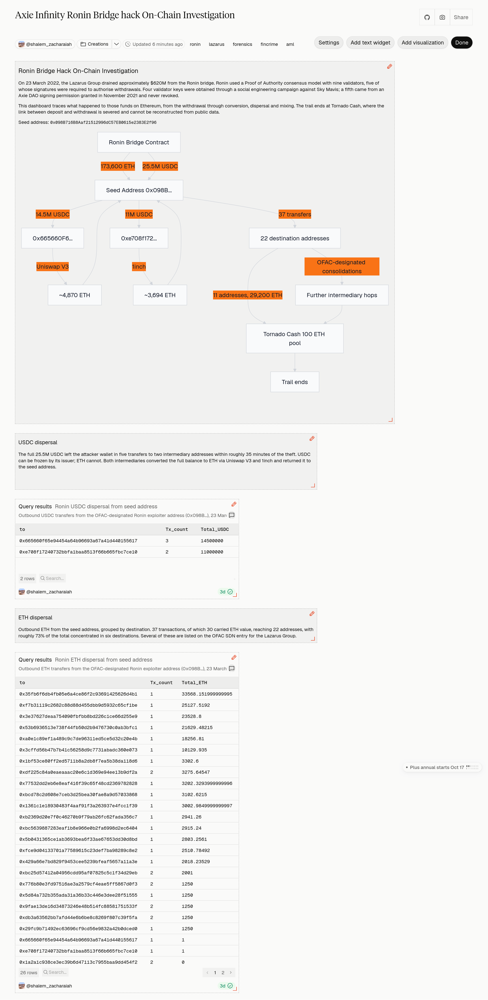
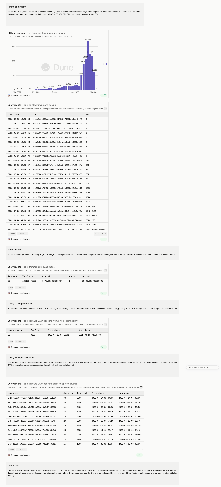
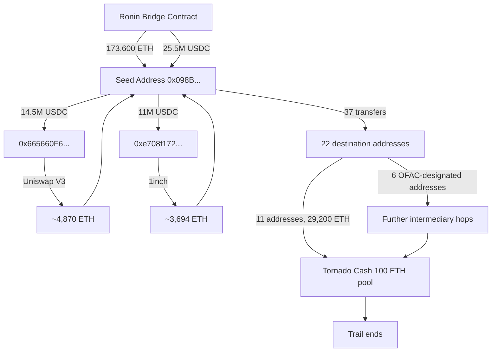

# Axie Infinity Ronin Bridge Hack — On-Chain Investigation

An independent reconstruction of the March 2022 Ronin bridge theft, tracing
the stolen funds on Ethereum from the withdrawal through conversion,
dispersal and mixing, using primary sources and public on-chain data.

This is a reconstruction of a publicly documented incident. The goal is to
demonstrate investigative methodology, not to present original findings.

**Live dashboard:** https://dune.com/shalem_zacharaiah/axie-infinity-ronin-bridge-hack-on-chain-investigation




---

## Executive summary

On 23 March 2022, the Lazarus Group drained approximately $620M from the
Ronin bridge by obtaining five of the nine validator signatures required to
authorise withdrawals. The theft moved 173,600 ETH and 25,500,000 USDC to a
single address in two transactions. It went undetected for six days, and was
discovered only when a user failed to withdraw funds.

The stolen USDC left the attacker wallet within roughly 35 minutes, was
converted to ETH through two intermediary addresses, and was returned to the
primary wallet. The ETH was then dispersed between 28 March and 4 May across
22 addresses, and eventually deposited into the Tornado Cash 100 ETH pool in
uniform tranches. Beyond that point the trail cannot be followed from public
data.

Total outflow traced: **182,163.96 ETH**, reconciling against the 173,600 ETH
stolen plus approximately 8,564 ETH returned from USDC conversion.



---

## Background

Axie Infinity is a play-to-earn game built by Sky Mavis, running on Ronin, an
Ethereum sidechain. Ronin used a Proof of Authority consensus model with nine
validators: four operated by Sky Mavis, one by the Axie DAO, and four by
third parties. Bridge withdrawals required five of nine validator signatures.

In November 2021, during a period of network congestion, Sky Mavis was
granted temporary permission to sign on behalf of the Axie DAO validator.
The arrangement ended in December 2021, but the signing permission was never
revoked from the validator allowlist.

Four Sky Mavis validator keys were obtained through a social engineering
campaign. Combined with the un-revoked DAO permission, this gave the
attackers the five signatures the bridge required. The contract executed the
withdrawals as designed; no code was exploited.

At the time, US Treasury described it as the largest virtual asset heist to
date. It has since been surpassed, including by the February 2025 Bybit
theft (~$1.5B), also attributed to the Lazarus Group.

Dollar valuations vary between roughly $610M and $625M across sources,
depending on the ETH price applied and whether value is measured at
execution or at disclosure. The underlying amounts, 173,600 ETH and
25,500,000 USDC, are fixed.

---

## Attribution and sanctions

| Date | Action |
|---|---|
| 14 Apr 2022 | FBI attributes the theft to Lazarus Group and APT38 |
| 14 Apr 2022 | OFAC adds `0x098B716B8Aaf21512996dC57EB0615e2383E2f96` to the Lazarus Group SDN entry |
| 18 Apr 2022 | FBI / CISA / Treasury publish the TraderTraitor advisory (aa22-108a) |
| 6 May 2022 | OFAC designates Blender.io, the first virtual currency mixer ever sanctioned |
| 8 Aug 2022 | OFAC designates Tornado Cash |
| 29 Nov 2023 | OFAC designates Sinbad.io, citing Axie Infinity funds |

The TraderTraitor advisory documents DPRK actors targeting blockchain firms,
including play-to-earn games, with social engineering that delivers
trojanised cryptocurrency applications, subsequently used to gain system
access. The advisory does not name Ronin, and is cited here as corroboration
of the method rather than proof of this specific intrusion.

**Note on address selection.** The OFAC SDN entry for the Lazarus Group lists
multiple ETH addresses accumulated across several designations from 2019
onward, covering different thefts. Only the address added in the 14 April
2022 action is attributable to the Ronin incident. The remaining addresses
relate to other operations and are excluded from this trace.

Evidence: `screenshots/01_ofac_sdn_lazarus.png`,
`screenshots/02_ofac_designation_20220414.png`,
`screenshots/03_fbi_attribution.png`,
`screenshots/04_tradertraitor_advisory.png`. Primary sources accessed
7 September 2026.

---

## Methodology

The trace begins at the OFAC-designated address and follows funds outward
using Etherscan and SQL queries against Ethereum data on Dune Analytics.

Three categories of movement were examined separately, as each is recorded
differently on-chain:

- **Native ETH transfers** — `ethereum.transactions`
- **Contract-driven ETH movement** — internal transactions, `ethereum.traces`
- **Token transfers** — `tokens_evm.transfers`

The bridge withdrawal of 173,600 ETH appears only as an internal transaction,
since the funds were released by the bridge contract during execution. A
trace limited to the main transactions view would miss it entirely.

Etherscan's default spam filter was disabled for this analysis. The filter
suppressed the legitimate 25.5M USDC withdrawal alongside genuine spam. Spam
transfers were subsequently excluded by judgement rather than by tool
default.

Funds cannot be traced *through* shared infrastructure such as the Uniswap V3
Router or 1inch Aggregation Router, since those contracts handle traffic from
thousands of unrelated parties. The trail is continued instead by following
the asset output returned to the initiating address, which preserves the
chain of custody without needing to trace inside the contract.

---

## The theft

Seed address: `0x098B716B8Aaf21512996dC57EB0615e2383E2f96`

Two withdrawal transactions were submitted to the Ronin bridge contract
within five blocks of each other on 23 March 2022. Both show a value of
0 ETH, as the attacker was calling the contract rather than sending funds.
The payouts are recorded separately: the ETH as an internal transaction, the
USDC as an ERC-20 transfer.

| Block | Transaction | Asset | Amount | Recorded as |
|---|---|---|---|---|
| 14442835 | `0xc28fad5e8d5e0ce6a2eaf67b6687be5d58113e16be590824d6cfa1a94467d0b7` | ETH | 173,600 | Internal transaction |
| 14442840 | `0xed2c72ef1a552ddaec6dd1f5cddf0b59a8f37f82bdda5257d9c7c37db7bb9b08` | USDC | 25,500,000 | ERC-20 transfer |

Both were executed by the bridge contract in response to validly signed
requests. No contract vulnerability was exploited; the threshold was met
with compromised keys.

Evidence: `screenshots/05_seed_address_overview.png`,
`screenshots/06_eth_withdrawal_internal.png`,
`screenshots/07_usdc_transfers.png`

---

## USDC conversion

*Criminal behaviour tested: rapid conversion of freezable stablecoin
holdings into a non-freezable asset, through intermediary addresses that
distance the conversion from the primary attacker wallet.*

The full 25,500,000 USDC left the seed address in five transfers to two
addresses, both funded by the seed address itself, within approximately 35
minutes of the theft.

USDC can be frozen by its issuer. ETH cannot. Circle subsequently froze
approximately $33M of USDC that had not been converted in time.

### `0x665660F65e94454A64b96693a67a41D440155617`

Received 14,500,000 USDC across three transfers (blocks 14442954, 14442976,
14442995). All converted to ETH via the Uniswap V3 Router in three Multicall
swaps, returning 338, 3,360.44 and 1,170.75 ETH — 4,869.19 ETH total. A
fourth swap at block 14443004 failed. The ETH was returned in full to the
seed address in three transfers, leaving a residual balance of 0.000007 ETH.

### `0xe708f17240732bBfa1BaA8513F66b665Fbc7ce10`

Received 11,000,000 USDC across two transfers (blocks 14442948, 14442981).
All converted to ETH via the 1inch Aggregation Router V4 in three swaps,
returning 337.88, 1,681.62 and 1,674.18 ETH — 3,693.68 ETH total. Returned
in full to the seed address in two transfers, leaving the same residual
balance of 0.000007 ETH.

### Combined USDC leg summary

| | `0x665660F6…` | `0xe708f172…` |
|---|---|---|
| USDC received | 14,500,000 | 11,000,000 |
| Venue | Uniswap V3 Router | 1inch Aggregation Router V4 |
| ETH returned to seed | 4,870.14 | 3,694.54 |

Amounts returned slightly exceed the swap output, as each intermediary also returned the 1 ETH it received for gas.

### Observations

- Both addresses operated purely as conversion pass-throughs, holding value
  only for the minutes required to swap.
- Conversion occurred within 1 to 14 blocks of each receipt, consistent with
  scripted rather than manual execution.
- The identical residual balance of 0.000007 ETH on both suggests a single
  automated process.
- The conversion was split across two venues rather than routed through a
  single pool, reducing slippage and fragmenting the trail.
- Routing through intermediaries rather than swapping directly from the seed
  address adds a hop without changing the economic outcome, consistent with
  deliberate layering.

All 25,500,000 USDC was converted to approximately 8,565 ETH and
consolidated back at the seed address within roughly 35 minutes.

Evidence: `screenshots/08_intermediary_665660f6.png`,
`screenshots/09_intermediary_e708f172.png`

---

## ETH dispersal

*Criminal behaviour tested: dispersal of stolen funds across multiple
destination addresses, and the operational tempo of that dispersal.*

37 outbound transactions between 23 March and 4 May 2022, of which 30 carried ETH value, reaching 22 destination addresses. The remaining transactions were gas-funding transfers of 1 ETH to the two USDC conversion intermediaries, and zero-value ERC-20 contract calls.

Roughly 73% of the total went to six destinations, several of which appear on the OFAC SDN entry for the Lazarus Group.

The pacing contrasts sharply with the USDC:

| Period | Behaviour |
|---|---|
| 23–28 Mar | Dormant for five days after the theft |
| 28–29 Mar | Small transfers of 500 to 1,250 ETH |
| 4–15 Apr | Steady escalation, 1,000 to 3,300 ETH |
| 18–27 Apr | Large consolidations, 10,129 to 33,568 ETH |
| 3–4 May | Final transfers of 23,528 and 12,595 ETH |

The USDC was moved under time pressure from a freeze risk that did not apply
to ETH. The ETH dispersal shows the opposite: a deliberate pause, small
initial transfers, then escalation once the route had been exercised.

Evidence: `screenshots/10_eth_dispersal_filter.png`

---

## Mixing

*Criminal behaviour tested: structure and tempo of deposits into a mixing
service, marking the point at which the trail is severed.*

Mixing is the final layering stage in this trace. The conversion,
intermediary routing and dispersal described above are also layering;
Tornado Cash is where the chain of custody breaks entirely.

Two distinct paths led into Tornado Cash.

### Direct deposits

11 of the 22 destination addresses deposited directly into the Tornado Cash
100 ETH pool (`0xd90e2f925DA726b50C4Ed8D0Fb90Ad053324F31b`), totalling
29,200 ETH across 292 uniform deposits between 4 and 15 April 2022. Deposit
counts track the amount received almost exactly, with the remainder covering
gas.

Example: `0x77532Dd2eB6E8EaF416F39C65f48cD2369782828` received 3,202.33 ETH
at 04:03 on 13 April and began depositing seven minutes later, pushing 3,200
ETH through in 32 deposits over 40 minutes.

### Indirect route

The larger OFAC-designated consolidation addresses did not deposit directly.
`0x53b6936513e738f44FB50d2b9476730C0Ab3Bfc1` received 21,629.48 ETH on 21
April, held it for approximately two weeks, then split it three ways. One
recipient, `0xedB60566F3fD86C2CD9DB744d59f019dAE0e45a6`, subsequently made
the same uniform 100 ETH deposits into Tornado Cash.

The additional layer delayed mixing and added distance from the theft, but
did not change the destination. `0x53b…` still holds approximately 79 ETH,
unmoved.

Evidence: `screenshots/11_ofac_53b_consolidation.png`,
`screenshots/12_edb60566_tornado_deposits.png`,
`screenshots/13_tornado_deposits_77532dd2.png`

---

## Reconciliation

| Metric | Value |
|---|---|
| Value-bearing transfers | 30 |
| Total ETH out | 182,163.96 |
| Average transfer | 6,072.13 ETH |
| Smallest | 1 ETH |
| Largest | 33,568.15 ETH |

This reconciles against 173,600 ETH stolen plus approximately 8,564 ETH
returned from USDC conversion. The full amount is accounted for.

Seven zero-value transactions were excluded as ERC-20 contract calls rather
than ETH transfers.

---

## Limitations

- **The trail ends at Tornado Cash.** Deposits and withdrawals are
  cryptographically unlinked by design. Reconstructing the connection
  requires timing-correlation analysis over the full deposit and withdrawal
  dataset, which is not available from open sources.
- **Cross-chain movement is out of scope.** Funds were subsequently
  converted to Bitcoin through instant exchange services. Because mixing
  occurred first, there is no starting point on the Bitcoin side to trace
  from.
- **Control of intermediary addresses is inferred** from funding
  relationships and behavioural patterns, not established directly.
  Ownership cannot be determined from on-chain data alone; attribution to a
  real-world entity would require off-chain records such as exchange KYC
  data, obtainable only through legal process.
- **No proprietary data was used.** This trace uses public block-explorer and
  on-chain data only. The official attribution additionally relied on
  intelligence collection and commercial analytics not reproduced here.
- **Intent is inferred from behaviour.** Conclusions about motive, such as
  freeze avoidance driving the USDC conversion, are supported by timing and
  outcome but cannot be established directly from on-chain evidence.
- **Open-source tooling was not used.** Platforms such as GraphSense support
  automated multi-hop tracing and clustering, and tools such as Tutela apply
  published heuristics to Tornado Cash deposit and withdrawal correlation.
  This trace relies on manual tracing and SQL against public chain data.
  Such heuristics yield associations rather than confirmed links, and the
  pacing observed in this case appears designed to defeat timing correlation.

---

## Queries

All six queries run against Ethereum data on Dune Analytics. SQL in
`queries/`, exported results in `data/`.

| # | Query | Link |
|---|---|---|
| 1 | USDC dispersal from seed address | https://dune.com/queries/8891102 |
| 2 | ETH dispersal from seed address | https://dune.com/queries/8891218 |
| 3 | Outflow timing and pacing | https://dune.com/queries/8892162 |
| 4 | Transfer sizing and totals | https://dune.com/queries/8894638 |
| 5 | Tornado Cash deposits, single intermediary | https://dune.com/queries/8894623 |
| 6 | Tornado Cash deposits, dispersal cluster | https://dune.com/queries/8894662 |

Query 6 derives its address list from the dispersal query rather than
hardcoding it.

---

## Sources

- OFAC Specially Designated Nationals List, Lazarus Group entry —
  sanctionssearch.ofac.treas.gov
- OFAC Recent Actions, 14 April 2022 —
  ofac.treasury.gov/recent-actions/20220414
- FBI, *Statement on Attribution of Malicious Cyber Activity Posed by the
  Democratic People's Republic of Korea*, 14 April 2022 — fbi.gov
- FBI / CISA / Treasury, *TraderTraitor: North Korean State-Sponsored APT
  Targets Blockchain Companies*, aa22-108a, April 2022 — cisa.gov
- Etherscan — etherscan.io
- Dune Analytics — dune.com

On-chain data accessed September to October 2026.

---

## Repository

```
├── README.md
├── queries/        SQL for each query
├── data/           Exported query results
├── screenshots/    Evidence captures
└── dashboard_*.png Dashboard overview
```
